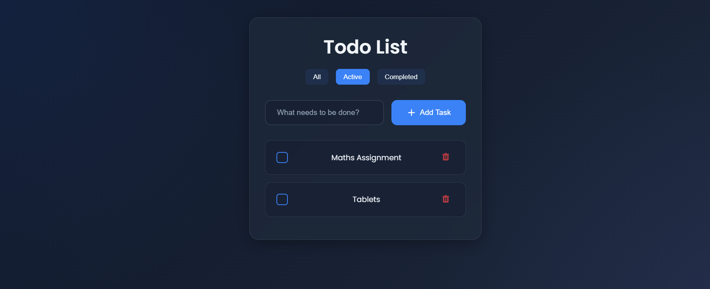
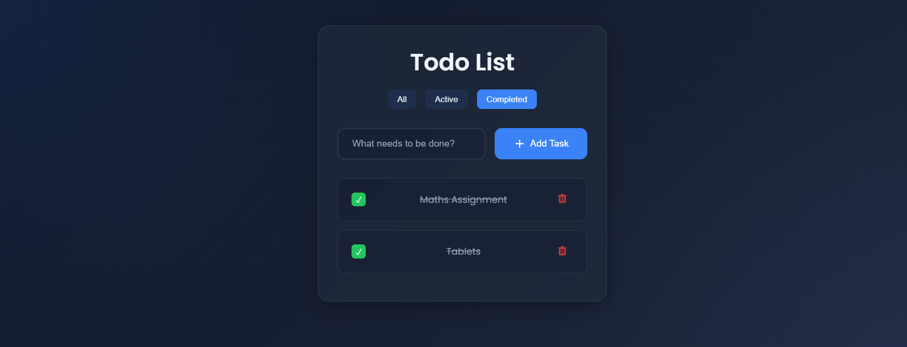
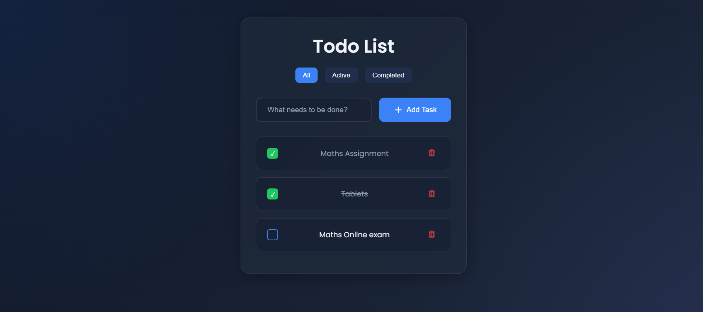

# Modern Todo List Application

A beautiful and modern Todo List application built with the MERN stack (MongoDB, Express.js, React, Node.js) featuring a dark mode UI with glassmorphism effects.

## Features

- 🌙 Dark mode with glassmorphism effects
- ✨ Modern and clean UI design
- 🔍 Filter todos by All/Active/Completed
- ✅ Mark todos as complete/incomplete
- 🗑️ Delete todos
- 💾 Data persistence with MongoDB
- 📱 Responsive design for all devices

## Screenshots

### All Todos View

*View of all todos with the ability to add new tasks*

### Completed Todos View

*View of completed todos with strike-through effect*

### Active Todos View

*View of active (incomplete) todos*

## Tech Stack

- **Frontend:**
  - React with TypeScript
  - Modern CSS with glassmorphism effects
  - Responsive design principles

- **Backend:**
  - Node.js with Express
  - MongoDB for data persistence
  - TypeScript for type safety

## Getting Started

1. Clone the repository:
```bash
git clone https://github.com/KesavaRamaSanjeev/todo-app-mern.git
cd todo-app-mern
```

2. Install dependencies:
```bash
# Install frontend dependencies
cd client
npm install

# Install backend dependencies
cd ../server
npm install
```

3. Set up environment variables:
Create a `.env` file in the server directory with:
```env
PORT=5000
MONGODB_URI=mongodb://localhost:27017/todo-app
```

4. Start the development servers:
```bash
# Start backend server
cd server
npm run dev

# Start frontend server (in a new terminal)
cd client
npm start
```

5. Open [http://localhost:3000](http://localhost:3000) to view the application

## Contributing

Contributions are welcome! Please feel free to submit a Pull Request.
